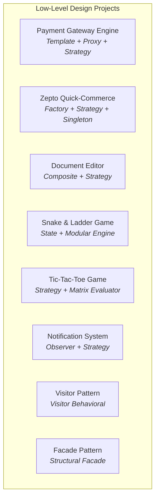

# 🚀 Java DSA, Revision & Low-Level Design (LLD) Mastery

A comprehensive, production-grade repository containing **Data Structures & Algorithms (DSA)**, **Core Java & OOPs Concepts**, **Pattern Printing**, **Technical Interview Coding Problems**, and **Full Low-Level System Design (LLD) Projects** with architectural UML diagrams and design patterns.

---

## 📌 Table of Contents

- [🌟 Repository Highlights](#-repository-highlights)
- [📁 Repository Structure](#-repository-structure)
- [🧠 Data Structures & Algorithms (DSA)](#-data-structures--algorithms-dsa)
  - [1. Arrays & Matrices (`ArrayAll.java`)](#1-arrays--matrices-arrayalljava)
  - [2. Linked Lists & LRU Cache (`LinkedList.java` & `LRUCache.java`)](#2-linked-lists--lru-cache-linkedlistjava--lrucachejava)
  - [3. Stacks & Queues (`stacks.java` & `QueusAll.java`)](#3-stacks--queues-stacksjava--queusalljava)
  - [4. Binary Trees & BST (`Trees.java` & `binarySearchTree.java`)](#4-binary-trees--bst-treesjava--binarysearchtreejava)
  - [5. Graph Algorithms (`graph.java` & `graph2.java`)](#5-graph-algorithms-graphjava--graph2java)
  - [6. Dynamic Programming (`dp.java`)](#6-dynamic-programming-dpjava)
  - [7. Greedy Algorithms (`greedyAlgorithm.java`)](#7-greedy-algorithms-greedyalgorithmjava)
  - [8. Sorting Algorithms (`sorting.java`)](#8-sorting-algorithms-sortingjava)
  - [9. Recursion & Backtracking (`Recursion.java`)](#9-recursion--backtracking-recursionjava)
  - [10. Strings & Sliding Window (`StringAll.java`)](#10-strings--sliding-window-stringalljava)
  - [11. Bit Manipulation (`bitOpe.java`)](#11-bit-manipulation-bitopejava)
  - [12. Mathematics & Number Theory (`mathproblem.java`)](#12-mathematics--number-theory-mathproblemjava)
  - [13. Object-Oriented Programming (`oops.java`)](#13-object-oriented-programming-oopsjava)
- [📐 Low-Level Design (LLD) Projects & Design Patterns](#-low-level-design-lld-projects--design-patterns)
  - [1. Payment Gateway Engine (`lld/paymentgateway/`)](#1-payment-gateway-engine-lldpaymentgateway)
  - [2. Zepto Quick-Commerce System (`lld/ZeptoClone/`)](#2-zepto-quick-commerce-system-lldzeptoclone)
  - [3. Rich Text Document Editor (`lld/DocumentEditorClient/`)](#3-rich-text-document-editor-llddocumenteditorclient)
  - [4. Snake and Ladder Game (`lld/SnakeAndLadder/`)](#4-snake-and-ladder-game-lldsnakeandladder)
  - [5. Tic-Tac-Toe Game Engine (`lld/Tic Tac Toe/`)](#5-tic-tac-toe-game-engine-lldtic-tac-toe)
  - [6. Multi-Channel Notification System (`lld/NotificationSystem/`)](#6-multi-channel-notification-system-lldnotificationsystem)
  - [7. Visitor Design Pattern (`lld/VisitorPattern/`)](#7-visitor-design-pattern-lldvisitorpattern)
  - [8. Facade Design Pattern (`lld/Facade Design Pattern/`)](#8-facade-design-pattern-lldfacade-design-pattern)
- [🧩 Pattern Printing Programs (`Pattern/`)](#-pattern-printing-programs-pattern)
- [💼 Interview Preparation & Practice Sets](#-interview-preparation--practice-sets)
  - [Interview Question Bank (`interview/interview.java`)](#interview-question-bank-interviewinterviewjava)
  - [Comprehensive Practice Set (`practiceSet.java`)](#comprehensive-practice-set-practicesetjava)
  - [Quick Revision Cheatsheet (`revision.java`)](#quick-revision-cheatsheet-revisionjava)
- [💻 Getting Started & Execution](#-getting-started--execution)
- [📊 Complexity Reference Cheat Sheet](#-complexity-reference-cheat-sheet)

---

## 🌟 Repository Highlights

- **Complete DSA Coverage**: 100+ data structure and algorithm implementations with clean, well-commented code.
- **System Design & LLD**: 8 real-world Low-Level Design projects built using industry-standard design patterns (Template Method, Proxy, Strategy, Factory, Singleton, Composite, Visitor, Facade).
- **Architectural Diagrams**: High-resolution UML class diagrams and requirement sheets included for each LLD module.
- **Interview Ready**: Curated problem sets, edge-case handlers, two-pointer techniques, sliding window patterns, and graph/tree traversals tailored for MAANG/Tier-1 software engineering interviews.
- **Zero External Dependencies**: Pure Java implementation compatible with JDK 8+.

---

## 📁 Repository Structure

```text
java_rivision/
├── 📄 ArrayAll.java            # 50+ Array, 2D Matrix, Two-Pointer & Sliding Window Problems
├── 📄 LinkedList.java          # Singly/Doubly Linked Lists, Floyd's Cycle, Merge Sort, Reversal
├── 📄 LRUCache.java            # O(1) LRU Cache using HashMap + Doubly Linked List
├── 📄 stacks.java              # Monotonic Stack, Histogram Area, Min Stack, Stock Span
├── 📄 QueusAll.java            # Circular Queue, Dual-Stack Queue, Stream Processing
├── 📄 Trees.java               # Binary Tree Traversals, Diameter, LCA, Views, Sum Tree
├── 📄 binarySearchTree.java    # BST Search, Insert, Delete, Balance, Range Query, Sorted to BST
├── 📄 graph.java               # BFS, DFS, Cycle Detection, Bipartite, Topological Sort (Kahn's)
├── 📄 graph2.java              # Dijkstra, Prim's, Kruskal's (DSU), Bellman-Ford, Kosaraju SCC
├── 📄 dp.java                  # 0/1 Knapsack, Unbounded Knapsack, LCS, Edit Distance, MCM, Coin Change
├── 📄 greedyAlgorithm.java     # Activity Selection, Fractional Knapsack, Job Sequencing, Chocola
├── 📄 sorting.java             # Bubble, Selection, Insertion, Counting, Merge, Quick Sort
├── 📄 Recursion.java           # Subsets, Combinations, N-Queens Backtracking, Divide & Conquer
├── 📄 StringAll.java           # Anagrams, Palindromes, Sliding Window, Longest Substring
├── 📄 bitOpe.java              # Bitwise Manipulation, Set Bit Counting, Fast Exponentiation
├── 📄 mathproblem.java         # Prime Sieve of Eratosthenes, GCD/LCM (Euclid), Armstrong, Digits
├── 📄 oops.java                # 4 Pillars of OOP, Polymorphism, Abstraction, Inheritance, Static
├── 📄 practiceSet.java         # Curated 30+ Advanced Interview Problems (Search in Rotated, Set Zeroes)
├── 📄 revision.java            # High-Yield Revision Cheatsheet & Linked List Snippets
├── 📁 Pattern/                 # Star & Number Pattern Printing Solutions
│   ├── 📄 Basic.java           # 12+ Visual Pyramid, Diamond, Butterfly, Floyd Patterns
│   └── 📄 README.md            # Pattern Guide & Visual Outlines
├── 📁 interview/               # Dedicated Interview Coding Bank
│   └── 📄 interview.java       # Array Rotations, Kadane's, Two-Sum, Peak Elements, Boundary Cases
└── 📁 lld/                     # Real-World Low-Level System Design Projects
    ├── 📁 paymentgateway/      # Payment Gateway System (Paytm/Razorpay, Proxy Retry, Controller)
    ├── 📁 ZeptoClone/          # Quick-Commerce System (Dark Stores, Inventory, Cart, Order, Payment)
    ├── 📁 DocumentEditorClient/# Rich Text Editor (Composite Elements, File/DB Persistence)
    ├── 📁 SnakeAndLadder/      # Multiplayer Board Game (Configurable Board, Snakes, Ladders, Dice)
    ├── 📁 Tic Tac Toe/         # Scalable N x N Tic-Tac-Toe Game Engine
    ├── 📁 NotificationSystem/  # Multi-Channel Notification Router (SMS, Email, Push)
    ├── 📁 VisitorPattern/      # Visitor Pattern (File System Size, Compression, Virus Scanner)
    └── 📁 Facade Design Pattern/# Facade Pattern (Complex Banking Subsystem Simplification)
```

---

## 🧠 Data Structures & Algorithms (DSA)

### 1. Arrays & Matrices ([`ArrayAll.java`](file:///c:/Users/satya/OneDrive/Desktop/java_rivision/ArrayAll.java))
Comprehensive collection of 50+ array algorithms, matrix manipulation, and optimal problem-solving techniques:

- **Searching & Extremes**:
  - `secondLargest(arr)` & `thirdLargest(arr)`: Single-pass $O(N)$ identification without sorting.
  - `maxAndMin(arr)`: Minimum and maximum elements in a single pass.
  - `peakNumber(arr)` & `peakElementLinear(arr)`: Identifying peak elements with binary search $O(\log N)$ and linear scan $O(N)$.
  - `firstOccurence(arr, target)` & `lastOccurence(arr, target)`: Boundary binary search.
- **Two Pointers & Sliding Window**:
  - `twoSum(arr, target)` & `twoSumByHashMap(arr, target)`: $O(N \log N)$ two-pointer vs $O(N)$ hash map approach.
  - `findMaxAverage(arr, k)`: Maximum average subarray of size $K$.
  - `subArraySum(arr, target)` & `countSubArrayEqualToK(arr, k)`: Prefix sum + HashMap technique for target sum subarrays.
  - `rearrangeArrayAlternatively(arr)` & `rearrangeBySign(arr)`: Alternating positive and negative arrangements.
- **Mathematical & Array Logic**:
  - `maxSubArray(arr)`: Kadane’s Algorithm for Maximum Subarray Sum ($O(N)$ time, $O(1)$ space).
  - `buySell(prices)`: Best Time to Buy and Sell Stock (Single-pass greedy profit calculation).
  - `majorityElement(arr)`: Boyer-Moore Voting Algorithm for element appearing $> N/2$ times.
  - `majorityElemnetMoreThanNByThree(arr)`: Extended Boyer-Moore Voting Algorithm for $> N/3$ threshold.
  - `missingRangeFromOnetoN(arr, N)` & `missingNum(arr, k)`: Sum formula and XOR techniques.
  - `findSingle(arr)`: Bitwise XOR to find the non-repeating element among duplicates.
  - `moveZero(arr)`: In-place two-pointer zero-shift to the end of the array.
  - `removeDuplicate(arr)`: In-place duplicate removal from sorted arrays.
  - `sortZeroOneTwo(arr)`: Dutch National Flag Algorithm for 3-way partitioning ($0, 1, 2$).
  - `leader(arr)`: Finding all leader elements (greater than all elements to their right).
  - `equilibrium(arr)`: Identifying the index where prefix sum equals suffix sum.
  - `ProductExceptSelfNaive(arr)`: Array product excluding current index.
  - `chocolateDistribution(arr, m)`: Minimum difference among $M$ distributed packets.
  - `union(arr1, arr2)` & `intersection(arr1, arr2)`: Set operations on arrays.
  - `commonElementSorted(arr1, arr2, arr3)`: Three-pointer intersection across 3 sorted arrays.
- **2D Matrix Operations**:
  - `spiralMatrix(matrix)`: Clockwise spiral traversal with boundary shrinkage.
  - `searchingIn2D(matrix, target)`: Staircase search in row-wise & column-wise sorted matrices in $O(M + N)$.
  - `MaxOne(matrix)`: Identifying the row with the maximum number of 1s in a boolean matrix.
  - `pascalTriangle(row, col)`: Binomial coefficient $nCr$ calculation for Pascal's Triangle.

---

### 2. Linked Lists & LRU Cache ([`LinkedList.java`](file:///c:/Users/satya/OneDrive/Desktop/java_rivision/LinkedList.java) & [`LRUCache.java`](file:///c:/Users/satya/OneDrive/Desktop/java_rivision/LRUCache.java))

- **Core Singly Linked List**:
  - `addFirst(data)`, `addLast(data)`, `add(index, data)`: Insertion at head, tail, and arbitrary index.
  - `removeFirst()`, `removeLast()`, `removeValue(key)`: Deletion operations.
  - `length()`: Iterative and recursive length computation.
  - `itrSearch(key)` & `recSearch(key)`: Linear and recursive search.
- **Classic Linked List Problems**:
  - `reverse()`: In-place iterative 3-pointer list reversal ($O(N)$ time, $O(1)$ space).
  - `deleteNthfromEnd(n)`: Two-pointer (slow/fast) gap technique to remove the $N$-th node from the end.
  - `findMid(head)`: Tortoise and Hare (Slow & Fast pointer) algorithm.
  - `isPalindrome()`: Midpoint detection $\rightarrow$ second half reversal $\rightarrow$ comparison.
  - `isCycle()` & `removeCycle()`: Floyd’s Cycle-Finding Algorithm for loop detection and cycle unlinking.
  - `mergeSort(head)`: Merge sort on Linked List with $O(N \log N)$ complexity.
  - `zigZag()`: Alternate node interleaving (1st $\rightarrow$ Last $\rightarrow$ 2nd $\rightarrow$ 2nd Last).
- **Doubly Linked List (`DoubleLL`)**:
  - Bidirectional traversal, `addFirst`, `addLast`, `removeFirst`, `removeLast`, and `reverseDLL`.
- **LRU Cache Implementation ([`LRUCache.java`](file:///c:/Users/satya/OneDrive/Desktop/java_rivision/LRUCache.java))**:
  - Data structure combining `HashMap<Integer, Node>` with a custom Doubly Linked List having dummy `head` and `tail`.
  - Guaranteed $O(1)$ time complexity for both `get(key)` and `put(key, value)`.
  - Automatic eviction of Least Recently Used node upon reaching capacity.

---

### 3. Stacks & Queues ([`stacks.java`](file:///c:/Users/satya/OneDrive/Desktop/java_rivision/stacks.java) & [`QueusAll.java`](file:///c:/Users/satya/OneDrive/Desktop/java_rivision/QueusAll.java))

- **Stack Operations & Monotonic Stacks**:
  - Custom implementations: `StackB` (using `ArrayList`), `StackLL` (using custom `Node` Linked List).
  - `pushAtBottom(stack, data)`: Recursive stack bottom insertion.
  - `reverseString(str)`: Reversing string using Stack.
  - `reverseStack(stack)`: In-place stack reversal using recursion ($O(1)$ auxiliary space).
  - `stockSpan(stocks, span)`: Monotonic stack calculation of consecutive smaller/equal stock days.
  - `nextGreaterRight(arr)` & `prevSmaller(arr)`: Finding the next greater / previous smaller elements in $O(N)$.
  - `isValidParentheses(str)`: Bracket validation for `()`, `{}`, `[]`.
  - `isDuplicateParentheses(str)`: Detecting unnecessary/redundant enclosing brackets.
  - `maxAreaHistogram(heights)`: Maximum rectangular area in histogram using left/right smaller boundaries ($O(N)$).
- **Queues & Cross Implementations**:
  - `QueueArray` & `CircularQueue`: Fixed-size and wrap-around array implementations.
  - `QueueLL`: Dynamic Linked List based queue.
  - `Queue2Stack`: Queue implementation using two Stacks (`s1` and `s2`).
  - `Stack2Queue`: Stack implementation using two Queues (`q1` and `q2`).
  - `firstNonRepeating(str)`: First non-repeating character in a continuous character stream using a frequency array and Queue.
  - `interLeave(q)`: Interleaving the first half of a queue with the second half.
  - `queueReverse(q)`: Reversing a queue using an auxiliary stack.

---

### 4. Binary Trees & BST ([`Trees.java`](file:///c:/Users/satya/OneDrive/Desktop/java_rivision/Trees.java) & [`binarySearchTree.java`](file:///c:/Users/satya/OneDrive/Desktop/java_rivision/binarySearchTree.java))

- **Binary Trees (`Trees.java`)**:
  - `buildTree(nodes[])`: Tree construction from preorder sequence with `-1` null markers.
  - `preorder()`, `inorder()`, `postorder()`: Standard depth-first traversals.
  - `levelOrder(root)`: Breadth-First Search (BFS) with line breaks per level using a delimiter queue.
  - `height(root)`, `count(root)`, `sum(root)`: Recursive tree property evaluators.
  - `diameter(root)`: $O(N^2)$ brute force vs optimized $O(N)$ tracking `[diameter, height]` info.
  - `isSubtree(root, subRoot)`: Subtree isomorphism verification.
  - `topView(root)`: Vertical order traversal using Horizontal Distance (HD) mapping with `TreeMap`.
  - `kLevel(root, level, k)`: Printing all nodes at the $K$-th level.
  - `lca(root, n1, n2)` & `lca2(root, n1, n2)`: Lowest Common Ancestor (path-based vs single-traversal $O(N)$).
  - `minDist(root, n1, n2)`: Minimum edge distance between any two tree nodes.
  - `kAncestor(root, n, k)`: Finding the $K$-th parent of a target node.
  - `transformToSumTree(root)`: Converting a binary tree to a sum tree where each node equals the sum of its left and right subtrees.
- **Binary Search Trees (`binarySearchTree.java`)**:
  - `insert(root, val)` & `search(root, key)`: $O(H)$ BST operations.
  - `delete(root, val)`: Deletion handling 3 cases: leaf node, 1 child, and 2 children (finding Inorder Successor).
  - `printInRange(root, k1, k2)`: Range queries in BST.
  - `printRoot2Leaf(root, path)`: All root-to-leaf path generation.
  - `isValidBST(root, min, max)`: BST validation using range propagation.
  - `createMirror(root)`: Inverting/Mirroring a BST.
  - `createBST(arr, st, end)`: Constructing a balanced BST from a sorted array in $O(N)$.
  - `balanceBST(root)`: Converting an unbalanced BST to a balanced BST (Inorder extraction $\rightarrow$ Divide & Conquer reconstruction).
  - `largestBST(root)`: Finding the size of the largest valid BST within a general binary tree in $O(N)$.

---

### 5. Graph Algorithms ([`graph.java`](file:///c:/Users/satya/OneDrive/Desktop/java_rivision/graph.java) & [`graph2.java`](file:///c:/Users/satya/OneDrive/Desktop/java_rivision/graph2.java))

- **Graph Fundamentals (`graph.java`)**:
  - Adjacency List representation using `ArrayList<Edge>[]`.
  - `bfs(graph)` & `dfs(graph)`: Connected and disconnected component traversals.
  - `hasPath(graph, src, dest)`: Reachability check using DFS.
  - **Cycle Detection**:
    - `detectCycleUndirected(graph)`: DFS cycle detection in undirected graphs using parent tracking.
    - `isCycleDirected(graph)`: Directed graph cycle detection using recursion stack tracking (`vis[]` and `stack[]`).
  - `isBipartite(graph)`: 2-color BFS algorithm for bipartite graph verification.
  - **Topological Sorting**:
    - `topSortDFS(graph)`: Topological sorting using DFS + Stack.
    - `topSortBFS(graph)`: Kahn’s Algorithm using in-degree array and Queue.
  - `printAllPaths(graph, src, dest)`: Backtracking search to output all paths between source and destination.
- **Advanced Graph Algorithms (`graph2.java`)**:
  - **Dijkstra’s Algorithm**: Single-source shortest path for non-negative edge weights using a `PriorityQueue` ($O((V + E) \log V)$).
  - **Bellman-Ford Algorithm**: Single-source shortest path supporting negative edge weights and detecting negative cycles ($O(V \cdot E)$).
  - **Prim’s Algorithm**: Minimum Spanning Tree (MST) computation using PriorityQueue for Non-MST $\leftrightarrow$ MST edges ($O(E \log V)$).
  - **Kruskal’s Algorithm**: MST construction using greedy edge sorting and **Disjoint Set Union (DSU)** with *Union by Rank* and *Path Compression* ($O(E \log E)$).
  - **Kosaraju’s Algorithm**: Finding Strongly Connected Components (SCC) in a directed graph in 3 steps:
    1. Topo sort to get node finishing order.
    2. Transpose the graph (reverse all directed edges).
    3. DFS on transposed graph in order of finishing times ($O(V + E)$).

---

### 6. Dynamic Programming ([`dp.java`](file:///c:/Users/satya/OneDrive/Desktop/java_rivision/dp.java))

Top-down (Memoization) and Bottom-up (Tabulation) solutions for foundational DP paradigms:

- **1D DP**:
  - `fibonacci(n)`: $O(N)$ tabulation and memoization.
  - `climbingStairs(n)`: Number of distinct ways to climb $N$ stairs taking 1, 2, or 3 steps.
- **Knapsack Problems**:
  - `knapsack01(val, wt, W)`: 0/1 Knapsack problem (Memoization & 2D Tabulation).
  - `unboundedKnapsack(val, wt, W)`: Knapsack allowing infinite item repetitions.
  - `targetSum(arr, sum)` / `subsetSum(arr, sum)`: Partitioning and subset verification.
- **Coin Change**:
  - `coinChangeWays(coins, sum)`: Total number of combinations to form target sum.
  - `coinChangeMinCoins(coins, sum)`: Minimum number of coins required to achieve target sum.
- **String DP**:
  - `lcs(str1, str2)`: Longest Common Subsequence (Recursive, Memoization & Tabulation).
  - `longestCommonSubstring(str1, str2)`: Continuous longest matching substring.
  - `editDistance(str1, str2)`: Minimum operations (Insert, Delete, Replace) to convert string 1 to string 2.
  - `wildcardMatching(text, pattern)`: String pattern matching supporting `?` (single char) and `*` (sequence of chars).
- **Matrix & Partition DP**:
  - `mcm(arr)`: Matrix Chain Multiplication to find minimum scalar multiplication cost (Tabulation & Memoization).
  - `minPartitioning(arr)`: Partitioning array into two subsets minimizing absolute difference of their sums.

---

### 7. Greedy Algorithms ([`greedyAlgorithm.java`](file:///c:/Users/satya/OneDrive/Desktop/java_rivision/greedyAlgorithm.java))

- `activitySelection(start, end)`: Maximum non-overlapping activities (Interval Scheduling).
- `fractionalKnapsack(val, weight, capacity)`: Value-to-weight ratio greedy selection.
- `minAbsoluteDifferencePairs(A, B)`: Minimum absolute difference sum between two arrays.
- `maxLengthChainOfPairs(pairs)`: Activity selection variant sorting by pair end values.
- `indianCoins(denominations, amount)`: Greedy coin change calculation for canonical currency systems.
- `jobSequencing(jobs)`: Maximizing profit by scheduling jobs before deadlines with deadline slot tracking.
- `chocolaProblem(horizontalCosts, verticalCosts)`: Minimum cost to cut an $N \times M$ chocolate board into $1 \times 1$ squares.

---

### 8. Sorting Algorithms ([`sorting.java`](file:///c:/Users/satya/OneDrive/Desktop/java_rivision/sorting.java))

- **Comparison Sorts**:
  - `bubbleSort(arr)`: $O(N^2)$ adjacent swapping with early exit optimization.
  - `selectionSort(arr)`: $O(N^2)$ finding the minimum element and placing it at the sorted frontier.
  - `insertionSort(arr)`: $O(N^2)$ placing elements into their correct position in the sorted prefix.
  - `mergeSort(arr, si, ei)`: $O(N \log N)$ Divide-and-Conquer stable sorting algorithm.
  - `quickSort(arr, si, ei)`: $O(N \log N)$ average-time pivot-partitioning sorting algorithm (Lomuto partition).
- **Non-Comparison Sort**:
  - `countingSort(arr)`: $O(N + K)$ linear sort for bounded integer ranges using frequency mapping.

---

### 9. Recursion & Backtracking ([`Recursion.java`](file:///c:/Users/satya/OneDrive/Desktop/java_rivision/Recursion.java))

- **Recursion Fundamentals**:
  - `factorial(n)`, `fibonacci(n)`, `sum(n)`: Core mathematical recursions.
  - `isSorted(arr, i)`: Recursive array order validation.
  - `firstOccurrence(arr, key, i)` & `lastOccurrence(arr, key, i)`: Recursive index search.
  - `power(a, b)`: $O(\log b)$ optimized binary exponentiation.
  - `tilingProblem(n)`: Counting ways to tile a $2 \times N$ board using $2 \times 1$ tiles.
  - `removeDuplicates(str, idx, newStr, map[])`: Removing duplicate characters using recursion.
  - `friendsPairing(n)`: Combinatorial ways to pair friends or keep them single.
  - `printBinaryStrings(n, lastPlace, str)`: Generating binary strings of length $N$ without consecutive 1s.
- **Backtracking & Combinatorics**:
  - `findSubsets(str, ans, i)`: Generating all $2^N$ subsets/power-set of a string.
  - `combinationSum(candidates, target)`: Backtracking for combinations that sum to target.
  - `nQueens(board, row)`: Placing $N$ non-attacking Queens on an $N \times N$ chessboard with `isSafe()` validation.

---

### 10. Strings & Sliding Window ([`StringAll.java`](file:///c:/Users/satya/OneDrive/Desktop/java_rivision/StringAll.java))

- **Two Pointers & Palindromes**:
  - `reverseString(str)`: In-place string reversal with two pointers.
  - `reverseWords(sentence)`: Reversing words in a sentence while preserving word order.
  - `isPalindrome(str)`: Case-sensitive and alphanumeric palindrome validation.
- **Anagrams & Frequency**:
  - `isAnagram(s1, s2)`: Frequency counting comparison ($O(N)$ time, $O(1)$ 26-char space).
  - `countCharFrequency(str)`: Character frequency histogram.
  - `firstNonRepeating(str)`: Identifying the first unique character.
- **String Transformations & Search**:
  - `toUpperCaseFirst(str)`: Capitalizing the first letter of every word.
  - `findLongestWord(str)`: Finding the longest word in a sentence.
  - `removeDuplicates(str)`: In-place removal of repeated characters.
  - `maxDepthParentheses(str)`: Maximum depth of nested parentheses.
  - `longestSubstringWithoutRepeating(str)`: Sliding window technique using `HashSet` to find the longest substring with unique characters in $O(N)$.
  - `removeAsterisks(str)`: Stack-based string parsing.

---

### 11. Bit Manipulation ([`bitOpe.java`](file:///c:/Users/satya/OneDrive/Desktop/java_rivision/bitOpe.java))

- **Bitwise Fundamentals**: Bitwise `AND`, `OR`, `XOR`, `NOT`, Left Shift (`<<`), Right Shift (`>>`).
- `getIthBit(n, i)`: `(n & (1 << i)) != 0`
- `setIthBit(n, i)`: `n | (1 << i)`
- `clearIthBit(n, i)`: `n & ~(1 << i)`
- `updateIthBit(n, i, newBit)`: Clearing then setting the bit.
- `clearIBits(n, i)`: Clearing the last $i$ bits with mask `~0 << i`.
- `clearBitsInRange(n, i, j)`: Masking and clearing bits between indices $i$ and $j$.
- `isPowerOfTwo(n)`: Checking if a number is a power of 2 using `(n & (n - 1)) == 0`.
- `countSetBits(n)`: Counting set bits using Brian Kernighan’s Algorithm ($O(\text{set bits})$).
- `fastExponentiation(a, n)`: Binary exponentiation in $O(\log n)$ using bitwise shifting.

---

### 12. Mathematics & Number Theory ([`mathproblem.java`](file:///c:/Users/satya/OneDrive/Desktop/java_rivision/mathproblem.java))

- `isPrime(n)`: Prime verification in $O(\sqrt{N})$.
- `sieveOfEratosthenes(n)`: Generating all primes up to $N$ in $O(N \log \log N)$.
- `gcd(a, b)`: Euclidean Algorithm for Greatest Common Divisor in $O(\log(\min(a, b)))$.
- `lcm(a, b)`: $(a \times b) / \gcd(a, b)$.
- `isArmstrong(n)`: Sum of digits raised to the power of number of digits.
- `reverseNumber(n)`: Digit extraction and reversal.
- `countDigits(n)`: Logarithmic digit count computation.

---

### 13. Object-Oriented Programming ([`oops.java`](file:///c:/Users/satya/OneDrive/Desktop/java_rivision/oops.java))

- **4 Pillars of OOP**:
  1. **Encapsulation**: Private state variables with getters and setters.
  2. **Inheritance**: Single, Multilevel, and Hierarchical class derivation.
  3. **Polymorphism**:
     - *Compile-time (Static)*: Method Overloading with varying parameter signatures.
     - *Runtime (Dynamic)*: Method Overriding using `@Override` and dynamic method dispatch.
  4. **Abstraction**: Abstract classes with concrete/abstract methods and pure Interfaces.
- **Constructors**: Parameterized constructors, Default constructors, Shallow vs Deep Copy constructors.
- **Keywords**: `super` (accessing parent constructors/methods), `this` (current instance), and `static` (class-level variables, methods, blocks, and nested classes).

---

## 📐 Low-Level Design (LLD) Projects & Design Patterns

The `lld/` directory contains full, executable object-oriented system designs accompanied by UML diagrams:



---

### 1. Payment Gateway Engine ([`lld/paymentgateway/`](file:///c:/Users/satya/OneDrive/Desktop/java_rivision/lld/paymentgateway/))

A complete multi-banking payment routing engine with automatic retry mechanisms.

- **Design Patterns Used**:
  - **Template Method Pattern**: `PaymentGateway` defines the template steps (`validatePayment`, `initiatePayment`, `confirmPayment`).
  - **Strategy Pattern**: `BankingSystem` interface implemented by `PaytmBankingSystem` and `RazorpayBankingSystem`.
  - **Proxy Pattern**: `PaymentGatewayProxy` intercepts requests to add automated retry policies upon transient network failures.
  - **Singleton Pattern**: `GatewayFactory`, `PaymentService`, and `PaymentController` are singletons managing client workflows.
- **Architecture Flow**:
  `Client` $\rightarrow$ `PaymentController` $\rightarrow$ `GatewayFactory` $\rightarrow$ `PaymentGatewayProxy` $\rightarrow$ `RealGateway (Paytm/Razorpay)` $\rightarrow$ `BankingSystem`
- **UML & Diagrams**:
  - [`lld/paymentgateway/UML.jpeg`](file:///c:/Users/satya/OneDrive/Desktop/java_rivision/lld/paymentgateway/UML.jpeg)
  - [`lld/paymentgateway/Requirements.jpeg`](file:///c:/Users/satya/OneDrive/Desktop/java_rivision/lld/paymentgateway/Requirements.jpeg)

---

### 2. Zepto Quick-Commerce System ([`lld/ZeptoClone/`](file:///c:/Users/satya/OneDrive/Desktop/java_rivision/lld/ZeptoClone/))

An end-to-end quick-delivery e-commerce architecture managing micro-warehouses (dark stores), localized inventory, dynamic cart calculations, and delivery partner assignments.

- **Design Patterns Used**:
  - **Factory Pattern**: `ProductFactory` for SKU and product catalog instantiation.
  - **Repository / Strategy Pattern**: `InventoryStore` interface implemented by `DbInventoryStore`.
  - **Singleton Pattern**: Order processing and payment dispatching managers.
- **Core Entities**:
  - `Product`: SKU, name, price.
  - `InventoryStore`: Stock management, reservation, and stock reconciliation.
  - `DarkStore / Warehouse`: Geospatial store selection based on customer delivery pin-code.
  - `Cart & CartItem`: Real-time price and tax calculations.
  - `Order & OrderManager`: Order state machine (CREATED $\rightarrow$ PACKED $\rightarrow$ OUT_FOR_DELIVERY $\rightarrow$ DELIVERED).
  - `DeliveryPartner`: Fleet management and nearest rider assignment.
- **UML Diagram**:
  - [`lld/ZeptoClone/UML.jpeg`](file:///c:/Users/satya/OneDrive/Desktop/java_rivision/lld/ZeptoClone/UML.jpeg)

---

### 3. Rich Text Document Editor ([`lld/DocumentEditorClient/`](file:///c:/Users/satya/OneDrive/Desktop/java_rivision/lld/DocumentEditorClient/))

An extensible document processing client capable of rendering rich text, images, tab spaces, and line breaks, with storage abstraction.

- **Design Patterns Used**:
  - **Composite Pattern**: `DocumentElement` interface unified across leaf nodes (`TextElement`, `ImageElement`, `NewLineElement`, `TabSpaceElement`) and composite container (`Document`).
  - **Strategy Pattern (Persistence)**: `Persistence` interface decoupled from document logic with `FileStorage` and `DBStorage` drivers.
- **UML Diagram**:
  - [`lld/DocumentEditorClient/standardUml.png`](file:///c:/Users/satya/OneDrive/Desktop/java_rivision/lld/DocumentEditorClient/standardUml.png)

---

### 4. Snake and Ladder Game ([`lld/SnakeAndLadder/`](file:///c:/Users/satya/OneDrive/Desktop/java_rivision/lld/SnakeAndLadder/))

A fully modular and configurable board game engine supporting arbitrary board sizes, variable dice counts, multiple players, and custom snake/ladder layouts.

- **Core Entities**:
  - `Board`: Configurable grid cells ($N \times N$) with Jump (Snake: Head > Tail, Ladder: Start < End) mappings.
  - `Dice`: Configurable dice count with random rolling mechanism ($1 \dots 6$).
  - `Player`: Player tracking and position state.
  - `GameEngine`: Turn-based circular queue with win condition checks.
- **UML Diagram**:
  - [`lld/SnakeAndLadder/UML.jpeg`](file:///c:/Users/satya/OneDrive/Desktop/java_rivision/lld/SnakeAndLadder/UML.jpeg)

---

### 5. Tic-Tac-Toe Game Engine ([`lld/Tic Tac Toe/`](file:///c:/Users/satya/OneDrive/Desktop/java_rivision/lld/Tic%20Tac%20Toe/))

An $N \times N$ extensible Tic-Tac-Toe game supporting dynamic player counts and custom playing pieces.

- **Core Entities**:
  - `PlayingPiece`: Base class extended by `PieceX` and `PieceO`.
  - `Board`: $N \times N$ grid with move validation and board rendering.
  - `Player`: Encapsulating player name and assigned piece.
  - `TicTacToeGame`: Game loop evaluating row, column, diagonal, and anti-diagonal win conditions in $O(1)$ per move.
- **UML Diagram**:
  - [`lld/Tic Tac Toe/UML.jpeg`](file:///c:/Users/satya/OneDrive/Desktop/java_rivision/lld/Tic%20Tac%20Toe/UML.jpeg)

---

### 6. Multi-Channel Notification System ([`lld/NotificationSystem/`](file:///c:/Users/satya/OneDrive/Desktop/java_rivision/lld/NotificationSystem/))

A notification dispatching system routing messages across SMS, Email, and Mobile Push Notifications.

- **Design Patterns Used**:
  - **Strategy Pattern**: `NotificationSender` interface with `SMSNotificationSender`, `EmailNotificationSender`, and `PushNotificationSender`.
  - **Observer / Service Layer**: Dynamic subscriber dispatch based on user channel preferences.
- **UML Diagram**:
  - [`lld/NotificationSystem/UML.png`](file:///c:/Users/satya/OneDrive/Desktop/java_rivision/lld/NotificationSystem/UML.png)

---

### 7. Visitor Design Pattern ([`lld/VisitorPattern/`](file:///c:/Users/satya/OneDrive/Desktop/java_rivision/lld/VisitorPattern/))

Demonstrates the behavioral **Visitor Pattern** by separating algorithms from the object structure on which they operate.

- **Object Structure**: `FileSystemItem` hierarchy (`TextFile`, `ImageFile`, `VideoFile`) implementing `accept(FileSystemVisitor visitor)`.
- **Visitors**:
  - `SizeCalculationVisitor`: Calculates storage foot-print for each item type.
  - `CompressionVisitor`: Applies custom compression algorithms based on file formats.
  - `VirusScanningVisitor`: Analyzes binaries and contents for security threats.
- **UML Diagrams**:
  - [`lld/VisitorPattern/Standard UML.jpeg`](file:///c:/Users/satya/OneDrive/Desktop/java_rivision/lld/VisitorPattern/Standard%20UML.jpeg)
  - [`lld/VisitorPattern/Example UML.jpeg`](file:///c:/Users/satya/OneDrive/Desktop/java_rivision/lld/VisitorPattern/Example%20UML.jpeg)

---

### 8. Facade Design Pattern ([`lld/Facade Design Pattern/`](file:///c:/Users/satya/OneDrive/Desktop/java_rivision/lld/Facade%20Design%20Pattern/))

Demonstrates the structural **Facade Pattern** by providing a clean, unified interface to a set of complex banking and security subsystem interfaces.

- **UML Diagrams**:
  - [`lld/Facade Design Pattern/Standard UML.jpeg`](file:///c:/Users/satya/OneDrive/Desktop/java_rivision/lld/Facade%20Design%20Pattern/Standard%20UML.jpeg)
  - [`lld/Facade Design Pattern/Example UML.jpeg`](file:///c:/Users/satya/OneDrive/Desktop/java_rivision/lld/Facade%20Design%20Pattern/Example%20UML.jpeg)

---

## 🧩 Pattern Printing Programs ([`Pattern/`](file:///c:/Users/satya/OneDrive/Desktop/java_rivision/Pattern/))

Located in [`Pattern/Basic.java`](file:///c:/Users/satya/OneDrive/Desktop/java_rivision/Pattern/Basic.java), containing 12+ visual loop-building exercises:

| Pattern Name | Visual Preview | Method Name |
| :--- | :--- | :--- |
| **Right-Angle Triangle** | `*`<br/>`* *`<br/>`* * *` | `rightAngleTriangle(n)` |
| **Number Triangle** | `1`<br/>`1 2`<br/>`1 2 3` | `numberTriangle(n)` |
| **Inverted Triangle** | `* * * *`<br/>`* * *`<br/>`* *` | `invertedTriangle(n)` |
| **Pyramid Pattern** | `   *`<br/>`  ***`<br/>` *****` | `pyramid(n)` |
| **Diamond Pattern** | `  *`<br/>` ***`<br/>`*****`<br/>` ***`<br/>`  *` | `Diamon(n)` |
| **Hollow Rectangle** | `* * * * *`<br/>`*       *`<br/>`* * * * *` | `hollow(row, col)` |
| **Butterfly Pattern** | `*      *`<br/>`**    **`<br/>`******`<br/>`**    **`<br/>`*      *` | `butterfly(n)` |
| **Floyd's Triangle** | `1`<br/>`2 3`<br/>`4 5 6` | `floyd_num(n)` |
| **0-1 Triangle** | `1`<br/>`0 1`<br/>`1 0 1` | `zeroOne(n)` |
| **Solid Rhombus** | `    *****`<br/>`   *****`<br/>`  *****` | `rhombus(n)` |
| **Hollow Rhombus** | `    *****`<br/>`   *   *`<br/>`  *****` | `hollow_Rhombus(n)` |
| **Inverted Number Pyramid** | `12345`<br/>`1234`<br/>`123` | `inverse_pyramid_number(n)` |

---

## 💼 Interview Preparation & Practice Sets

### Interview Question Bank ([`interview/interview.java`](file:///c:/Users/satya/OneDrive/Desktop/java_rivision/interview/interview.java))
Focused technical screening problems including:
- Smallest and Largest Element search
- Array Inversion & K-Step Array Rotation (`rotateKStep`)
- Move Zeroes to End
- Second Largest Element in single pass
- Remove duplicates from sorted arrays
- Max Subarray Sum (Kadane's Algorithm)
- Two Sum problem variants
- Majority Element ($> N/2$)
- Altitude gain computation

### Comprehensive Practice Set ([`practiceSet.java`](file:///c:/Users/satya/OneDrive/Desktop/java_rivision/practiceSet.java))
30+ challenging coding round problems with optimal solutions:
- **Search in Rotated Sorted Array** (`search`, `searchs`)
- **Find Minimum in Rotated Sorted Array** (`findMinimum`, `minimum`)
- **Floor and Ceil in Sorted Array** (`floor`, `ceil`)
- **First and Last Position of Element** (`searchRange`, `firstPos`, `lastPos`)
- **Maximum Product Subarray** (`maxProduct`)
- **Set Matrix Zeroes** (`setZero`) in $O(1)$ space
- **Isomorphic Strings** (`Isomorphic`)
- **Longest Subarray with Sum $K$** (`longestSubArray`) & **Subarray with Sum 0** (`sumZero`)
- **Intersection of Two Linked Lists** (`Intersection`)
- **Odd Even Linked List Segregation** (`oddAndEven`)
- **Subsets Generation using Backtracking** (`subsets`, `backtrack`)
- **Binary Tree Construction & Traversals** (`buildTree`, `preOrder`, `inOrder`, `postOrder`, `level`)

### Quick Revision Cheatsheet ([`revision.java`](file:///c:/Users/satya/OneDrive/Desktop/java_rivision/revision.java))
Compact, high-yield code snippets for quick pre-interview review of Linked List node operations, length calculations, and $N$-th node extraction.

---

## 💻 Getting Started & Execution

### Prerequisites
- **Java Development Kit (JDK)**: Version 8 or higher (JDK 17 or 21 LTS recommended).
- **IDE / Editor**: Visual Studio Code, IntelliJ IDEA, Eclipse, or Command Line.

### Compilation and Execution

#### 1. Running Core DSA Modules
```bash
# Clone the repository
git clone https://github.com/Satyam6201/JAVA.git
cd JAVA

# Compile any module (e.g., ArrayAll.java)
javac ArrayAll.java
java ArrayAll

# Compile and run Graph Algorithms
javac graph2.java
java graph2

# Compile and run Dynamic Programming
javac dp.java
java dp
```

#### 2. Running Low-Level Design (LLD) Projects
```bash
# Run Payment Gateway System
cd lld/paymentgateway
javac PaymentGatewayApplication.java
java PaymentGatewayApplication

# Run Snake and Ladder Game
cd ../SnakeAndLadder
javac SnakeAndLadder.java
java SnakeAndLadder

# Run Zepto Quick-Commerce Engine
cd ../ZeptoClone
javac ZeptoClone.java
java ZeptoClone

# Run Visitor Pattern Demo
cd ../VisitorPattern
javac VisitorPattern.java
java VisitorPattern
```

#### 3. Running Pattern Printing
```bash
cd Pattern
javac Basic.java
java Basic
```

---

## 📊 Complexity Reference Cheat Sheet

| Data Structure / Algorithm | Time Complexity (Best) | Time Complexity (Average) | Time Complexity (Worst) | Space Complexity |
| :--- | :--- | :--- | :--- | :--- |
| **Binary Search** | $O(1)$ | $O(\log N)$ | $O(\log N)$ | $O(1)$ |
| **Kadane's Algorithm** | $O(N)$ | $O(N)$ | $O(N)$ | $O(1)$ |
| **Merge Sort** | $O(N \log N)$ | $O(N \log N)$ | $O(N \log N)$ | $O(N)$ |
| **Quick Sort** | $O(N \log N)$ | $O(N \log N)$ | $O(N^2)$ | $O(\log N)$ |
| **LRU Cache (`get`/`put`)** | $O(1)$ | $O(1)$ | $O(1)$ | $O(C)$ |
| **BST Search / Insert** | $O(1)$ | $O(\log N)$ | $O(N)$ | $O(H)$ |
| **Dijkstra's Algorithm** | $O(E \log V)$ | $O((V + E) \log V)$ | $O((V + E) \log V)$ | $O(V + E)$ |
| **Kruskal's MST (DSU)** | $O(E \log E)$ | $O(E \log E)$ | $O(E \log E)$ | $O(V + E)$ |
| **Kosaraju's SCC** | $O(V + E)$ | $O(V + E)$ | $O(V + E)$ | $O(V + E)$ |
| **0/1 Knapsack (DP)** | $O(N \cdot W)$ | $O(N \cdot W)$ | $O(N \cdot W)$ | $O(N \cdot W)$ |
| **LCS (DP Tabulation)** | $O(M \cdot N)$ | $O(M \cdot N)$ | $O(M \cdot N)$ | $O(M \cdot N)$ |

---

## ⭐ Contributing & Support

Feel free to fork this repository, submit issues, or create pull requests to add new algorithms, test cases, or design patterns. If this repository helped you in your learning or interview preparation, please star ⭐ the repository!